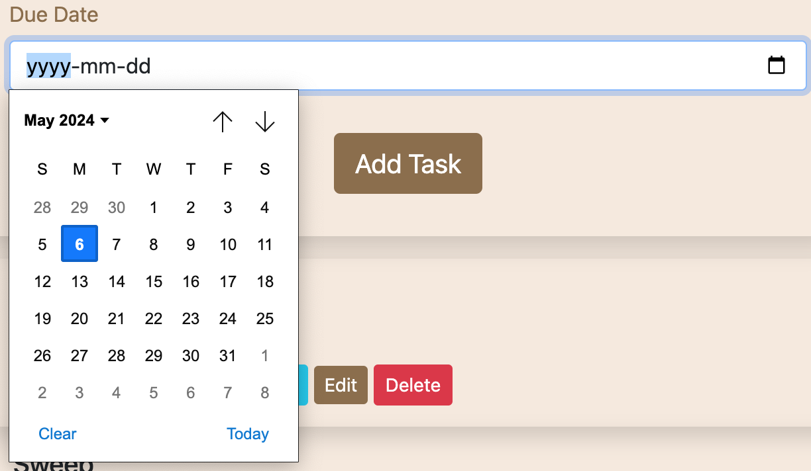

<h1 align="center">Taskify Hub Application</h1>

## Introduction

Taskify Hub is a task management web application designed to help users
organize their tasks efficiently. With Taskify Hub, users can create, update,
and delete tasks, set due dates, mark tasks as complete, and more. This
README provides an overview of the application, its features, installation
instructions, usage guidelines, and information about hosting it on
**[PythonAnywhere](https://taskifyhub.pythonanywhere.com/)**. You can connect
with me on [LinkedIn](https://www.linkedin.com/in/oyedele-abiodun/).

## Features
- <b>User Authentication:</b> Users can create an account, log in, and log out
    securely.
- <b>Task Management:</b> Users can create tasks with titles, descriptions,
    and due dates.
- <b>Edit Task:</b> Users can edit their tasks.
- <b>Delete Task:</b> Users can delete their tasks.
-  <b>Task Status:</b> Users can mark tasks as complete or incomplete.
- <b>Task Management:</b> Users can create tasks with titles, descriptions,
    and due dates.
-  <b>Password Reset:</b> Users can request a password reset if they forget
    their password.

## Technologies Used

### Frontend Frameworks and Libraries:
- <b>HTML5:</b> Used for structuring the web pages.
- <b>CSS3:</b> Used for styling the frontend components and layouts.
- <b>Bootstrap:</b> Frontend framework for designing responsive and
    mobile-first websites.

### Backend Frameworks and Libraries:
- <b>Flask:</b> Python-based micro web framework used for building the backend
    server.
- <b>Flask-Login:</b> Provides user session management, authentication, and
    authorization for Flask applications.
- <b>Flask-Bcrypt:</b> Used for password hashing.
- <b>Flask-Mail:</b> Used for sending emails from the Flask application.
- <b>Flask-SQLAlchemy:</b> Flask SQL toolkit and Object-Relational Mapping
    (ORM) library used for database management.
- <b>datetime:</b> Python module used for manipulating dates and times.
- <b>itsdangerous:</b> Python library used for data serialization and signing.
- <b>Flask-WTF:</b> Flask extension for handling web forms.
- <b>WTForms:</b> Library for building web forms with Flask.
- <b>SQLite:</b> Embedded relational database management system used for
    development and testing.

### Other Technologies:
- <b>Python 3:</b> Backend programming language.
- <b>Git:</b> Version control system used for tracking changes in the project
    codebase.
- <b>GitHub:</b> Hosting service for Git repositories.
- <b>PythonAnywhere:</b> Platform-as-a-Service (PaaS) used for deploying and
    hosting the application.

### Prerequisites
These are found in `requirements.txt`.

### Installation

- Clone the repository:
  `git clone https://github.com/Magret1730/taskify-hub-portfolio-project`

- Navigate to the project directory:
  `cd taskify-hub-portfolio-project`

- Install dependencies:
  `pip install -r requirements.txt`

### Running the Application

- Start the development server:
  `python3 app.py`

- Access the application at `http://localhost:5000` by default.

### Usage
#### Basic Usage Instructions
- Open your web browser and go to `http://localhost:5000`.
- Register for a new account or log in if you already have an account.
- Once logged in, you will be directed to the dashboard where
    you can manage your tasks.
- Create new tasks, mark tasks as complete, edit task details, or delete tasks
    as needed.
- Log out when you are done using the application.

#### Hosting on PythonAnywhere
 **[Taskify Hub](https://taskifyhub.pythonanywhere.com/)** is also hosted on PythonAnywhere.

#### Overview of Taskify Hub Application

 ## Contributing
Please read the **[Contribution instructions.](./CONTRIBUTING.md)**

## License
This project is licensed under the _MIT License_ - see the **[LICENSE](./LICENSE)**
file for details.

## Credits
Taskify Hub was created by Oyedele Abiodun Magret. It utilizes Flask,
SQLAlchemy, Bootstrap, and other open-source libraries.

## Contributor
- Oyedele Abiodun Magret [belloabiodun17@gmail.com](mailto:belloabiodun17@gmail.com) [LinkedIn](https://www.linkedin.com/in/oyedele-abiodun/) [X](https://twitter.com/OyedeleMagret)
